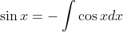

# MlxShake Tutorial

## Introduction

MlxShake provides tools for converting Matlab Live Scripts to Markdown files. This is useful in generating rich documentation for Matlab programs.

The main function is `exportlivescript`. There are also `mlx2latex` and `lslatex2markdown` functions for the individual steps of the process which give you finer-grained control over export options.

This Tutorial itself is generated from a Live Script using MlxShake!

## Installation and Setup

Download the project's distribution or clone the repo and put it somewhere on your disk.

Add its `Mcode` directory to your Matlab path using Matlab's `addpath()` function.

## Usage: Simple

All the code lives in the `janklab.mlxshake` package.

Call `exportlivescript(mlxFile)` on your `.mlx` Live Script file to export it to Markdown.

```matlab:Code(Display)
janklab.mlxshake.exportlivescript('README.mlx');
```

## Usage: Advanced

### Step 1: Export your Live Script to LaTeX using `mlx2latex`

```matlab:Code(Display)
janklab.mlxshake.mlx2latex('README.mlx');
```

This will generate `README.tex`. All the related images, such as included images and generated figures, are saved under the folder `README_images` next to the `.tex` file.

**WARNING**: When exporting to LaTeX right after running the Live Script, it's observed that the figures will be exported as EPS files or not at all if the Live Script contains more than 20 figures. I suggest that **you close the script, reopen it, and then export to LaTeX**.

### Step 2: Convert the LaTeX to Markdown using `lslatex2markdown`

```matlab:Code(Display)
janklab.mlxshake.lslatex2markdown('README');
```

This will generate `README.md`, a Markdown file suitable for GitHub.

The `latex2markdown` function supports the following options:

* `markdownPublishTarget`: Style of Markdown to generate, for targeting specific publishing platforms. May be `'gh-pages'` (default) or `'qiita'`
* `outFile`: The name of the Markdown file to be generated. If unspecified, will be the same as the Live Script, but with an `.md` file extension.
* `png2jpeg`: Convert PNG images to JPEG images to save space at the expense of image quality. May be `false` (default) or `true`.

The arguments are passed as a `janklab.mlxshake.ExportOptions` object, so you need to stick them in a `{...}`.

See the helptext and source code for `latex2markdown` for more details.

Example: A Markdown file suitable for Qiita, named `QiitaDraft.md`, will be generated by the following command:

```matlab:Code(Display)
janklab.mlxshake.lslatex2markdown('README', {'markdownPublishTarget', 'qiita', 'outFile', 'QiitaDraft'});
```

Note: Qiita is a tech blog platform in Japanese. Qiita uses Markdown for its posts.

## Usage: Running from the Command Line

You can also run MlxShake from the Mac or Linux command line (shell) using the bin/mlxshake program. This makes it easy to integrate MlxShake into automated document generation workflows.

```matlab:Code(Display)
$ ./bin/mlxshake MyLiveScript.mlx --format html
```

## Differences Between GitHub and Qiita Markdown Formats

One is the equations and the other is how to insert the image files.

Qiita allows you to use LaTeX to represent equations (like GitLab?) whereas GitHub does not. For GitHub, MlxShake uses CODECOGS ([https://latex.codecogs.com](https://latex.codecogs.com)) to render the equations as images.

Rendering equations with CODECOGS is done by sticking CODECOGS query URLs in image references in the Markdown. The image files are fetched from codecogs at document viewing time; they are not stored locally. This may not be suitable for all use cases.

For images, you can just push the image folders and then the README reads them, but you need to drag \& drop your images inside the Qiita Editor.

## Supported Syntax in Live Scripts

### A Fiddly Bit First

Let's use a localized random generator stream, so this script produces the same output every time it's run, but doesn't interfer with your Matlab session's global `random` state:

```matlab:Code
myRand = RandStream('dsfmt19937', 'Seed', 420);
```

### Matlab Code

Matlab code and its output will be shown as follows:

```matlab:Code
% Matlab code
x = linspace(0, 2*pi, 100);
y = sin(x)
```

```text:Output
y = 1x100
         0    0.0634    0.1266    0.1893    0.2511    0.3120    0.3717    0.4298    0.4862    0.5406    0.5929    0.6428    0.6901    0.7346    0.7761    0.8146    0.8497    0.8815    0.9096    0.9341    0.9549    0.9718    0.9848    0.9938    0.9989    0.9999    0.9969    0.9898    0.9788    0.9638    0.9450    0.9224    0.8960    0.8660    0.8326    0.7958    0.7557    0.7127    0.6668    0.6182    0.5671    0.5137    0.4582    0.4009    0.3420    0.2817    0.2203    0.1580    0.0951    0.0317

```

### Figure Plots

Matlab figure plots look like this:

```matlab:Code
% Figures
plot(x, y);
```


### Table Display

The display of `table` arrays will be formated like so:

```matlab:Code
array2table(rand(myRand, 3, 4))
```

| |Var1|Var2|Var3|Var4|
|:--:|:--:|:--:|:--:|:--:|
|1|0.1113|0.4581|0.3936|0.4607|
|2|0.4475|0.9551|0.9174|0.7811|
|3|0.7308|0.2488|0.1130|0.2779|

BUG: If the table contains multicolumn variables, the format is not perfect. Column headings will not be placed correctly.

```matlab:Code
table(rand(myRand, 3, 4))
```

| |Var1| | | |
|:--:|:--:|:--:|:--:|:--:|
|1|0.0163|0.3589|0.4683|0.0667|
|2|0.2430|0.2769|0.7698|0.7961|
|3|0.9317|0.5769|0.5706|0.8375|

(Any suggestions to handle merged cells in Markdown are appreciated!)

### Code Examples

Live Script "Code Examples" are the non-executable formatted code blocks that display code but do not evaluate it when the script is run.

"MATLAB" Code Examples are rendered as follows:

```matlab:Code(Display)
% Matlab Code Example display
x = linspace(0, 1, 100);
y = sin(x);
plot(x, y);
```

"Plain" Code Examples look like this:

```matlab:Code(Display)
# Python code
print('Hello, world!')
my_dict = {'foo': 42, 'bar': [1, 2, 3]}
```

### Inline Images

Here's a display of an inline image (an image pasted into the Live Script, as opposed to figure display output).


["Panda cat"](https://www.flickr.com/photos/84606435@N00/358199239) by [fox_kiyo](https://www.flickr.com/photos/84606435@N00) is licensed under [CC BY-SA 2.0](https://creativecommons.org/licenses/by-sa/2.0/?ref=ccsearch&atype=rich).

### Mathematical Equations

Any equations in Live Scripts will be exported as LaTeX. For GitHub, CODECOGS helps display them by rendering them as images at document viewing time.

Here's an inline equation: .

If you have multiple lines of equations:


Single line equations look like this:



### Lists

Here's a unordered list:

* Item foo
* Item bar
* Item baz

Here's an ordered list:

1. Item one
1. Item two
1. Item three

### Font Styles

Here are the complete list of font styles available in Live Editor:

* **Bold**
* *Italic*
* Underline
* `Monospace`

And some conbinations of styles:

* ***BoldItalic***
* **BoldUnderline**
* **`BoldMonospace`**
* *ItalicUnderline*
* *`ItalicMonospace`*
* `UnderlineMonospace`
* ***BoldItalicUnderline***
* ***`BoldItalicMonospace`***
* **`BoldUnderlineMonospace`**
* *`ItalicUnderlineMonospace`*

Note that underlines do not show up in the Markdown! (I think this is because Markdown doesn't have markup for underlines?)

### Quotations

There isn't a Live Script "quotation" feature, but MlxShake converts centered paragraphs to Markdown quotations.

> This centered paragraph in the Live Script is rendered as a quotation in Markdown.

## Feedback and Support

Hope this accelerates your Matlab life! Any comments and suggestions are welcome. Visit the project repo at [https://github.com/janklab/](https://github.com/janklab/ExportMlx)MlxShake.

<!-- This Markdown was generated from Matlab Live Script with Janklab MlxShake (https://mlxshake.janklab.net) -->
